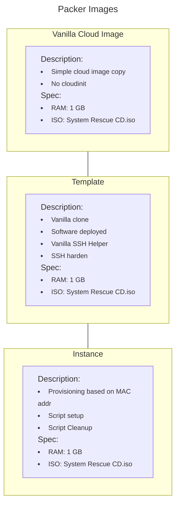

```mermaid
---
title: Packer Images
---
flowchart TD
    subgraph VD["Vanilla Cloud Image"]
        v["<p>Description:<small><li>Simple cloud image copy</li><li>No cloudinit</li></small></p><p>Spec:<small><li>RAM: 1 GB</li><li>ISO: System Rescue CD.iso</li></small></p>"]
    end

    subgraph TD["Template"]
        t["<p>Description:<small><li>Vanilla clone</li><li>Software deployed</li><li>Vanilla SSH Helper</li><li>SSH harden</li></small></p><p>Spec:<small><li>RAM: 1 GB</li><li>ISO: System Rescue CD.iso</li></small></p>"]
    end

    subgraph ID["Instance"]
        i["<p>Description:<small><li>Provisioning based on MAC addr</li><li>Script setup</li><li>Script Cleanup</li></small></p><p>Spec:<small><li>RAM: 1 GB</li><li>ISO: System Rescue CD.iso</li></small></p>"]
    end

    VD --- TD
    TD --- ID

    classDef smallText text-align:left
    class v,t,i smallText
```